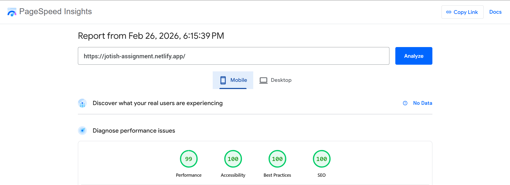
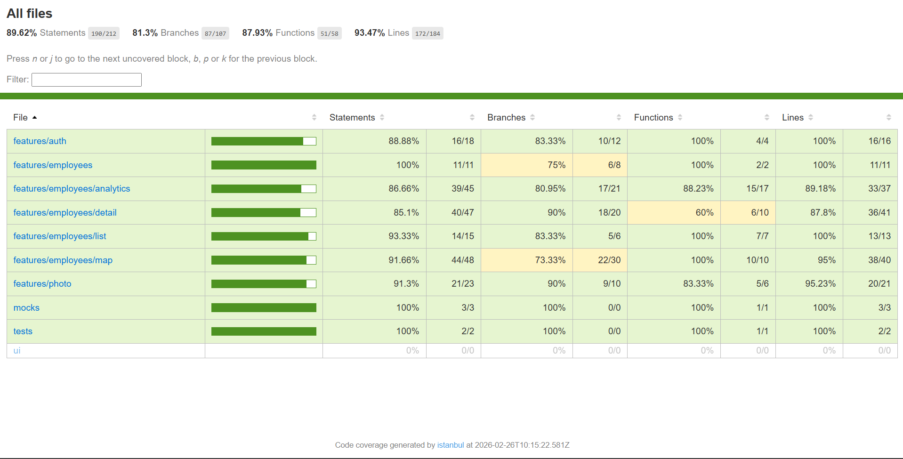
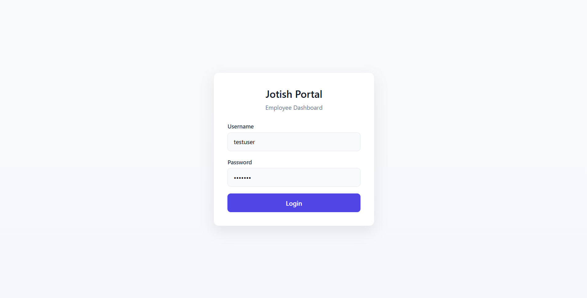
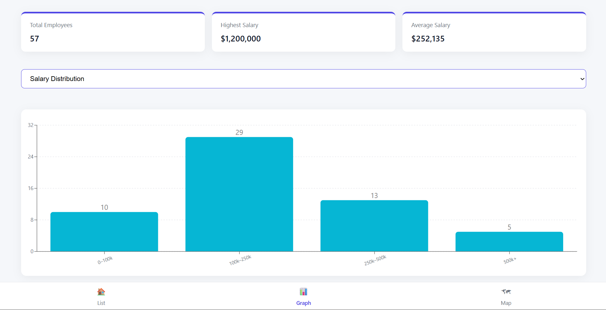
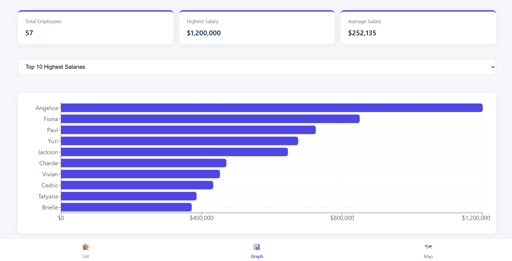
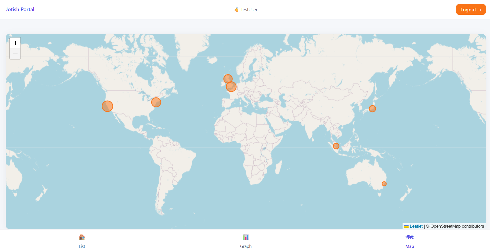

# Jotish ReactJS Assignment

A ReactJS application built as part of the Jotish Frontend Developer Internship assignment.

This application demonstrates:

- Multi-page routing
- API integration with React Query
- Data visualization (Charts & Maps)
- Camera integration using Web APIs
- Clean architecture with feature-based structure
- Error boundaries and robust routing

---

## Live Demo

Experience the fully deployed application:

https://jotish-assignment.netlify.app/

---

## Screenshots

---

### Performance

<table>
<tr>
<td align="center">
<b>Desktop</b><br/>

</td>
<td align="center">
<b>Mobile</b><br/>

</td>
</tr>
</table>

---

### Testing & Authentication

<table>
<tr>
<td align="center">
<b>Test Results</b><br/>

</td>
<td align="center">
<b>Login</b><br/>

</td>
</tr>
</table>

---

### Data Visualization

<table>
<tr>
<td align="center">
<b>City Distribution</b><br/>

</td>
<td align="center">
<b>Top 10</b><br/>

</td>
</tr>
<tr>
<td align="center">
<b>Salary Distribution</b><br/>

</td>
<td align="center">
<b>Map</b><br/>

</td>
</tr>
</table>

---

### Employee List

<p align="center">

</p>

---

## Performance & Engineering Highlights

- Redirects to **Analytics Dashboard** after login (stronger first impression)
- ~90% overall test coverage
- Comprehensive unit & integration testing (Vitest + Testing Library)
- API layer fully tested with MSW
- React Query caching (`staleTime = 2 minutes`)
- Lazy-loaded routes (code splitting)
- Production build optimized via Vite
- Lighthouse / PageSpeed optimized

---

## Tech Stack


---

### Login Page

- Username: `testuser`
- Password: `Test123`
- Client-side validation
- Redirects to Analytics Dashboard on success

---

### Employee List

- Fetches data from REST API
- Uses React Query for caching and state management
- Search/filter support (if implemented)
- Clickable employee cards

---

### Employee Details

- Displays selected employee information
- Includes camera capture functionality

---

### Camera Integration

- Uses `navigator.mediaDevices.getUserMedia`
- Captures image via `<canvas>`
- Proper stream cleanup after capture
- Works on:
  - Localhost
  - HTTPS deployments

⚠ Note: Camera requires HTTPS in production.

---

### Photo Result Page

- Displays captured image
- Allows retake/navigation

---

### Analytics (Bar Chart)

- Displays salary of first 10 employees
- Built using Recharts
- Interactive tooltips

---

### Map View

- Displays employee locations on map
- Implemented using Leaflet
- Responsive and mobile-friendly

---

## API Details

**Endpoint:**

https://backend.jotish.in/backend_dev/gettabledata.php

**POST Body:**

```json
{
  "username": "test",
  "password": "123456"
}
```

---

## Architecture Decisions

- Feature-based folder structure
- Shared layout shell
- Bottom navigation for primary views
- Lazy-loaded routes for performance
- Global error boundary
- Route-level error handling
- React Query caching with staleTime = 2 minutes
- SEO improvements (meta tags, robots.txt, canonical configuration)

---

## Testing & Code Coverage

Testing stack:

- Vitest
- React Testing Library
- MSW (Mock Service Worker)

Coverage includes:

- Component rendering
- Navigation behavior
- React Query loading & error states
- API transformation logic
- File validation (type + size)
- LocalStorage expiry logic
- Chart and map conditional rendering

### Coverage Summary

| Metric     | Coverage |
| ---------- | -------- |
| Statements | ~89%+    |
| Branches   | ~81%+    |
| Lines      | ~93%+    |
| Functions  | ~87%+    |

---

## Installation & Setup

### Clone the repository

```bash
git clone https://github.com/R-Pradhyumna/Jotish-assignment.git
cd Jotish-assignment
```

### Install dependencies

```bash
pnpm install
```

### Start development server

```bash
pnpm dev
App runs at: http://localhost:5173
```

## Production Build

```bash
pnpm build
pnpm preview
```

---

## Error Handling

- Global React Error Boundary
- Route-level error handling
- Graceful fallback UI
- Defensive API error messaging

---

## Project Policies

- [Code of Conduct](./CODE_OF_CONDUCT.md)
- [Contributing Guidelines](./CONTRIBUTING.md)
- [Security Policy](./Security.md)
- [MIT License](./LICENSE.md)

---

## Author

R Pradhyumna
